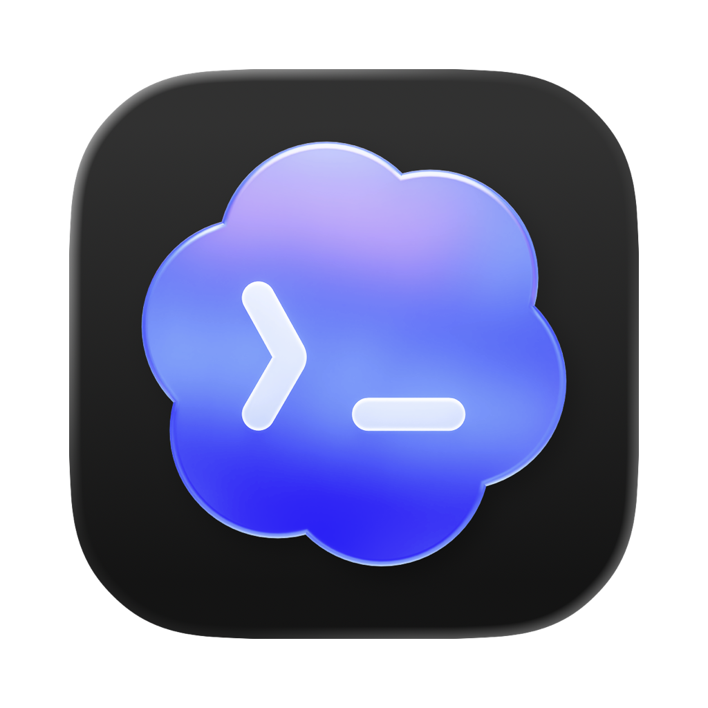

<div align="center">
  
  <h1>Codex Usage Menu</h1>
  <p>在 macOS 菜单栏中查看 Codex 5 小时与每周剩余用量。</p>

  [](https://github.com/cjkcr/CodexUsageMenu/releases/latest)
  [](https://github.com/cjkcr/CodexUsageMenu/releases/latest)
  [](https://github.com/cjkcr/CodexUsageMenu/releases/latest)
</div>

<p align="center">
  <picture>
    <source media="(prefers-color-scheme: dark)" srcset="docs/menu-bar-dark.png">
    
  </picture>
</p>

Codex Usage Menu 是一款轻量的原生 macOS 菜单栏工具。它通过本机已登录的 Codex CLI 读取 ChatGPT Codex 用量，在菜单栏中直接显示 `5 H`、`WEEK`、剩余百分比和可用重置次数。

## 下载与安装

前往 [GitHub Releases](https://github.com/cjkcr/CodexUsageMenu/releases/latest) 下载最新版本：

- **DMG**：打开后双击“安装 Codex Usage Menu.pkg”。
- **PKG**：直接运行 macOS 安装器。

应用固定安装到 `/Applications/Codex Usage Menu.app`，安装结束后会自动打开。它是纯菜单栏应用，因此不会占用 Dock，也不会出现在应用切换器中。

### 系统要求

- macOS 13 Ventura 或更新版本
- Apple Silicon 或 Intel Mac
- 已安装并登录 Codex CLI，或已安装包含 Codex CLI 的 ChatGPT/Codex 应用

### 首次打开

当前公开安装包使用本地签名，尚未经过 Apple Developer ID 签名与公证。如果 macOS 阻止首次打开，请进入“系统设置 → 隐私与安全性”，在安全性提示处选择“仍要打开”。请只从本项目的 Releases 页面下载安装包。

## 功能

- 菜单栏同时显示 5 小时和每周剩余用量。
- 显示服务端返回的可用重置次数。
- 点击菜单栏可查看精确重置时间和最近更新时间。
- 支持完整、紧凑和仅图标三种显示方式。
- 自动适配刘海屏以及菜单栏空间较窄的 Mac。
- 自动适配浅色、深色和不同壁纸背景。
- 支持简体中文、繁体中文和英文界面。
- 单实例运行，重复打开不会产生多个菜单栏图标或进程。
- 关闭用量窗口后继续在菜单栏运行；再次从“应用程序”打开即可恢复窗口。

## 菜单栏显示方式

| 模式 | 行为 |
| --- | --- |
| 自动 | 刘海屏使用仅图标；窄屏使用紧凑模式；空间充足时显示完整内容 |
| 完整 | 显示 `5 H`、`WEEK`、百分比、重置次数和图标 |
| 紧凑 | 缩短间距，在较少空间内保留主要信息 |
| 仅图标 | 只显示 24 点宽的应用图标，适合 13 英寸刘海屏 |

如果菜单栏项目过多，macOS 仍可能把项目藏在刘海后。可先关闭其他菜单栏项目，图标出现后按住 Command 将它拖到右侧。

## 刷新策略

应用启动时立即查询一次用量，随后每分钟判断本机是否正在使用 Codex：

- Codex 或 ChatGPT 位于前台，或最近 5 分钟内有 Codex 会话更新时，每 2 分钟查询一次。
- 未检测到使用活动时，每小时查询一次。
- “立即刷新”始终可以手动触发查询。

这种策略兼顾数据及时性与后台资源消耗。

## Codex CLI 查找

应用会自动检查以下位置：

- ChatGPT.app 与 Codex.app 内置的 Codex CLI
- `~/.local/bin`、`~/.codex/bin` 等常见用户目录
- nvm、Volta、asdf、mise 和 pnpm 目录
- Homebrew 路径及当前 `PATH`

仅在自动查找失败时，菜单中才会出现“选择 Codex CLI…”。手动选择的路径只保存在本机。

诊断应用实际找到的路径：

```sh
"/Applications/Codex Usage Menu.app/Contents/MacOS/CodexUsageMenu" --diagnose-cli
```

如果 CLI 尚未登录，请先在终端运行：

```sh
codex login
```

## 数据与隐私

用量数据来自 Codex app-server 的 `account/rateLimits/read`。应用不自建服务器、不收集遥测，也不保存用量历史。

- 剩余百分比按 `100 - usedPercent` 计算。
- “重置次数”对应服务端的 `rateLimitResetCredits.availableCount`。
- 服务端未返回的数据以 `—` 显示。

## 本地构建

需要 macOS 和 Swift 命令行工具：

```sh
./build.sh
open "build/Codex Usage Menu.app"
```

生成通用安装包：

```sh
./package.sh
```

产物位于 `dist/`，同时包含适用于 Apple Silicon 与 Intel Mac 的 DMG 和 PKG。`VERSION` 是应用、安装包和 GitHub Release 的唯一版本来源。

## 发布流程

完成并验证代码更新后运行 `./release.sh`。脚本会增加补丁版本、创建标签并推送；GitHub Actions 随后构建、校验并发布新的 DMG、PKG 与 SHA-256 校验文件。

---

Codex Usage Menu 是社区项目，与 OpenAI 没有隶属或背书关系。
